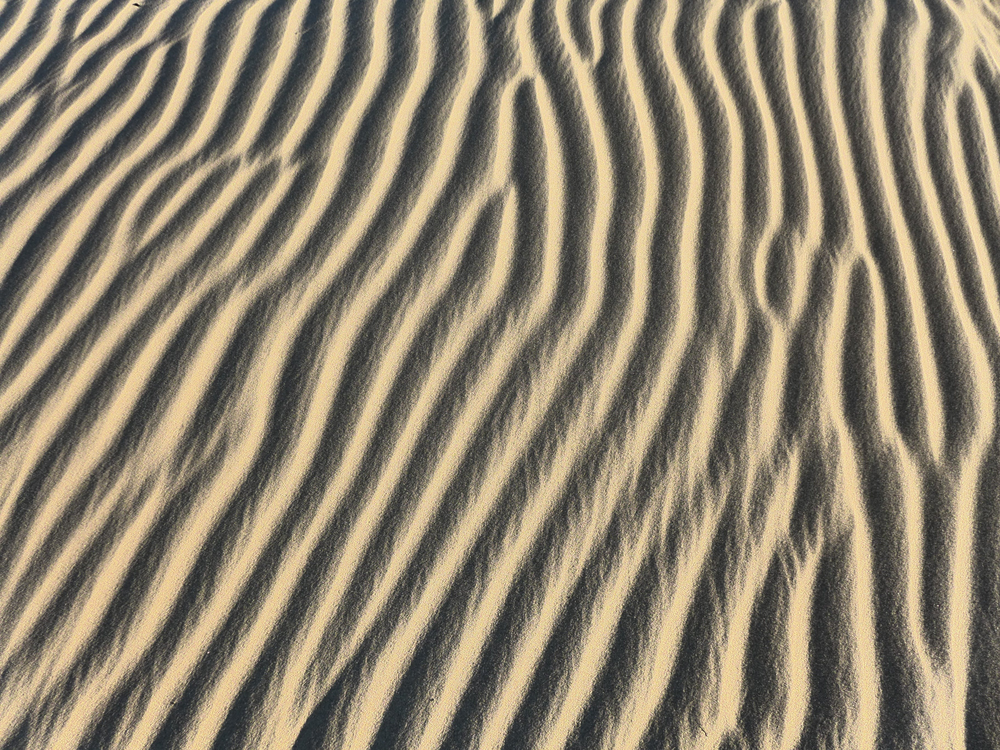

# Stochastic Pattern Selection

This code was written for my PhD thesis in statistical physics. The problem I solved with the code is known as wavenumber selection in pattern formation.

## Non-technical introduction to pattern formation and pattern selection
Pattern formation occurs in nature when systems arrange themselves in regular patterns due to changes in their environment.
How often a pattern repeats itself is measured in terms of something known as a "wavenumber". In the photo below, sand on the beach shows a rippled form and the average distance between stripes represents the wavenumber. 

Typically, a system can adopt a large range of wavenumbers, however, in practice it is observed that most systems are overwhelmingly biased toward one particular wavenumber. This is known as "pattern selection". What makes this selected wavenumber so special and how is it chosen? Here we answer that question. Our hypothesis is that random fluctuations in the surroundings drive the system toward a pattern with a specific "selected" wavenumber.

The aim of this code is to take a differential equation which is a good proxy for a real system. Random fluctuations are introduced by using Python's built-in random number generator. The differential equation is solved and the behavior of the wavenumbers is studied.

# Technical Details
## Definitions
1. Model equation (SKS equation): $\frac{\partial u}{\partial t} = -\alpha u - \frac{\partial^2 u}{\partial x^2} - \frac{\partial^4 u}{\partial x^4} + \left( \frac{\partial u}{\partial x} \right)^2 + \eta(x,t)$
2. $\alpha$ is the control parameter. Without noise, when $\alpha > \alpha_c$, the steady solution of the SKS equation is $u(x)=0$. On the other hand, when $\alpha \leq \alpha_c$, the steady solution is periodic with wavenumber $q$. 
3. When the noise $\eta$ is added, the steady state is a combination of different wavenumbers. The wavenumber corresponding to the maximum of the power spectrum of the solution is the selected wavenumber. The aim is to find it.

## Methods used
1. Semi-implicit Euler time-stepping - The SKS equation is converted to Fourier space.
   $\frac{\partial u_q}{\partial t} = -\alpha u_q - q^2 \alpha - q^4 u_q + \mathcal{N}_q + \eta_q$.   $\mathcal{N}_q$ is the Fourier transform of the nonlinear term. The equation is integrated in time using a Semi-implicit Euler scheme (Chen 1998). The advantage is that the time step in the algorithm is allowed to be much larger than in the explicit Euler case.
2. Pseudo-spectral method - In Fourier space, the linear derivative terms in the SKS equation are transformed to simple multiplications, which are much faster to carry out than evaluating derivatives in space. On the other hand, taking the Fourier transform of the nonlinear term involves a convolution which is very computationally expensive. The solution is to calculate the term $\left( \frac{\partial u}{\partial x} \right)^2$ in x - space first and transform it to Fourier space for the next iteration (Trefethen 2000).
3. The FFT package was used to find the Fourier transforms.

## Results (Refs. 1 and 2)
1. The Fourier transform $u_q$ is computed at every time step for all $q$. The $q$ with the maximum power $|u_q|^2$ is noted at each time and called $q_{max}$. After a long time, a histogram of $q_{max}$ is plotted. The wavenumber of the peak of the histogram is then the selected wavenumber. This was done for different $\alpha$. Once such histogram is shown below, along with a plot of the selected wavenumber versus $\alpha$. (Saxena 2019, 2021).

## References
1. S. Saxena, J. M. Kosterlitz, Phys. Rev. E 100, 022223 (2019) https://journals.aps.org/pre/abstract/10.1103/PhysRevE.100.022223
2. S. Saxena, J. M. Kosterlitz, Phys. Rev. E 103, 012205 (2021) https://journals.aps.org/pre/abstract/10.1103/PhysRevE.103.012205
3. L. Q. Chen, J. Shen, Computer Physics Communications, Vol. 108, 147-158 (1998).
4. L. N. Trefethen, Spectral Methods in MATLAB, SIAM (Philadelphia 2000).
